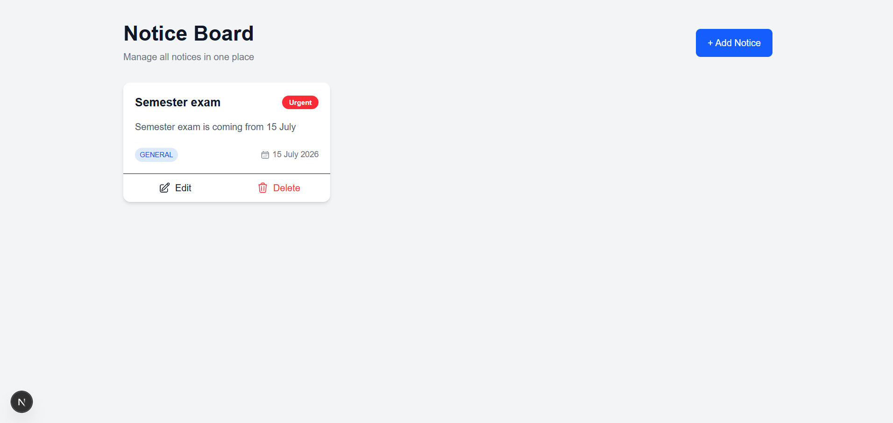
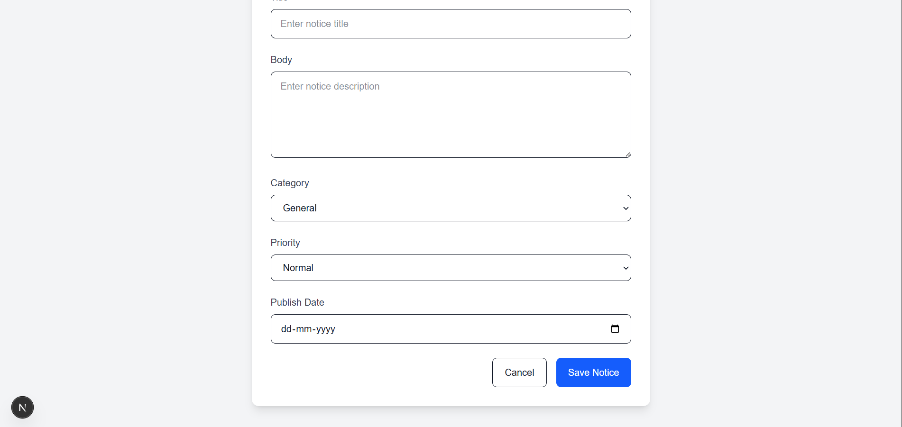
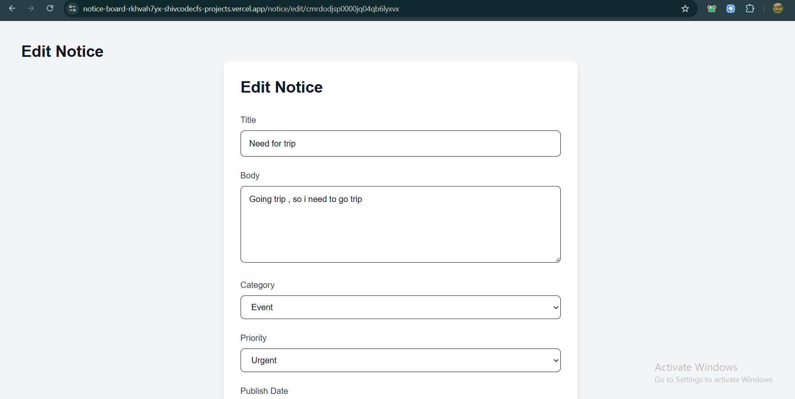
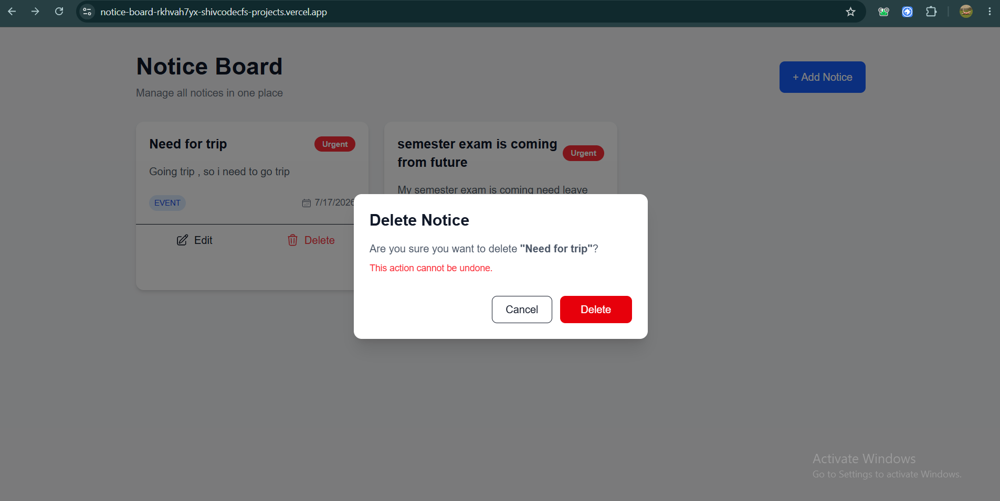

# 📌 Notice Board

A modern Notice Board application built with **Next.js, TypeScript, Prisma, Supabase, Tailwind CSS, React Hook Form, and Zod**.

The application allows administrators to create, update, delete, and manage notices with a clean and responsive interface.

---

## 🚀 Live Demo

**Frontend & Backend:** https://notice-board-opal-pi.vercel.app

---

## 📂 GitHub Repository

https://github.com/shivcodecf/notice-board

---

# ✨ Features

- ✅ Create Notice
- ✅ View All Notices
- ✅ Edit Notice
- ✅ Delete Notice
- ✅ Delete Confirmation Modal
- ✅ Responsive UI
- ✅ Form Validation using Zod
- ✅ React Hook Form Integration
- ✅ Toast Notifications
- ✅ Loading States
- ✅ Reusable Components
- ✅ Prisma ORM
- ✅ Supabase PostgreSQL Database

---

# 🛠 Tech Stack

### Frontend

- Next.js (Pages Router)
- React
- TypeScript
- Tailwind CSS
- Axios
- React Hook Form
- Zod
- React Hot Toast

### Backend

- Next.js API Routes
- Prisma ORM
- Supabase PostgreSQL

---

# 📁 Folder Structure

```
.
├── components
│   ├── DeleteModal.tsx
│   ├── NoticeCard.tsx
│   ├── NoticeForm.tsx
│   └── SkeletonCard.tsx
│
├── lib
│   ├── prisma.ts
│   ├── noticeSchema.ts
│   └── validation.ts
│
├── pages
│   ├── api
│   │   └── notices
│   │       ├── index.ts
│   │       └── [id].ts
│   │
│   ├── notice
│   │   ├── add.tsx
│   │   └── edit
│   │       └── [id].tsx
│   │
│   └── index.tsx
│
├── prisma
│   ├── schema.prisma
│   └── migrations
│
├── services
│   └── notice.service.ts
│
└── types
```

---

# 🗄 Database Schema

| Field | Type |
|--------|------|
| id | String |
| title | String |
| body | String |
| category | EXAM / EVENT / GENERAL |
| priority | NORMAL / URGENT |
| publishDate | DateTime |
| image | String (Optional) |
| createdAt | DateTime |
| updatedAt | DateTime |

---

# 📌 API Endpoints

## Get All Notices

```
GET /api/notices
```

---

## Create Notice

```
POST /api/notices
```

---

## Get Single Notice

```
GET /api/notices/:id
```

---

## Update Notice

```
PUT /api/notices/:id
```

---

## Delete Notice

```
DELETE /api/notices/:id
```

---

# ⚙️ Installation

Clone the repository

```bash
git clone https://github.com/shivcodecf/notice-board.git
```

Move into the project

```bash
cd notice-board
```

Install dependencies

```bash
npm install
```

Create a `.env` file

```env
DATABASE_URL=your_supabase_database_url
```

Generate Prisma Client

```bash
npx prisma generate
```

Run migrations

```bash
npx prisma migrate dev
```

Start the development server

```bash
npm run dev
```

---

# 🧪 Validation

Client-side validation is implemented using:

- React Hook Form
- Zod

Server-side validation is performed before creating or updating notices.

---


### Deployment Notes

- The application is deployed on Vercel.
- Supabase Session Pooler is used for the production `DATABASE_URL` to ensure efficient and reliable database connections in a serverless environment.


---


# 🎨 UI Highlights

- Responsive Layout
- Modern Card Design
- Delete Confirmation Modal
- Loading Spinner
- Skeleton Loading
- Toast Notifications
- Reusable Form Component

---

# 🔮 Future Improvements

- Authentication & Authorization
- Search & Filter
- Pagination
- Image Upload
- Rich Text Editor
- Dark Mode

---

# 🤖 AI Usage

AI was used as a development assistant during this project.

It helped with:

- Discussing implementation approaches.
- Reviewing code structure and suggesting improvements.
- Explaining framework concepts (Next.js, Prisma, TypeScript).
- Improving UI/UX ideas and README formatting.

All application architecture, implementation, debugging, testing, and final code review were completed and verified by me.

---

# 📸 Screenshots

## Home Page



---

## Add Notice



---

## Edit Notice



---

## Delete Confirmation



---

# 👨‍💻 Author

**Shivam Yadav**

GitHub: https://github.com/shivcodecf

LinkedIn: https://www.linkedin.com/in/shivam-yadav-620a03232/